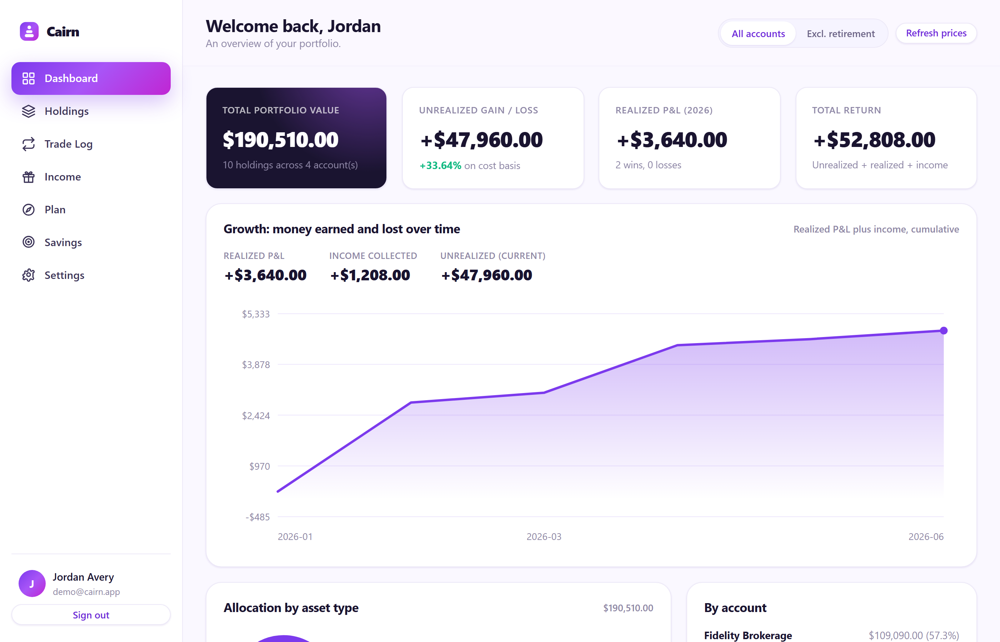
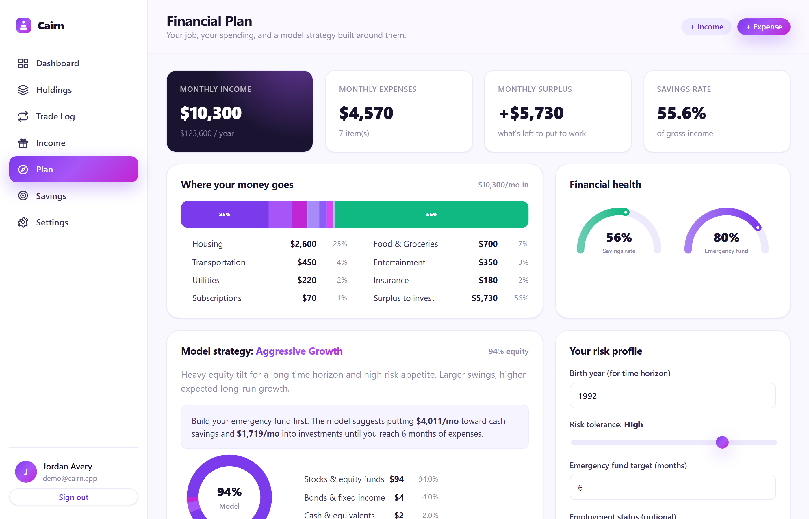
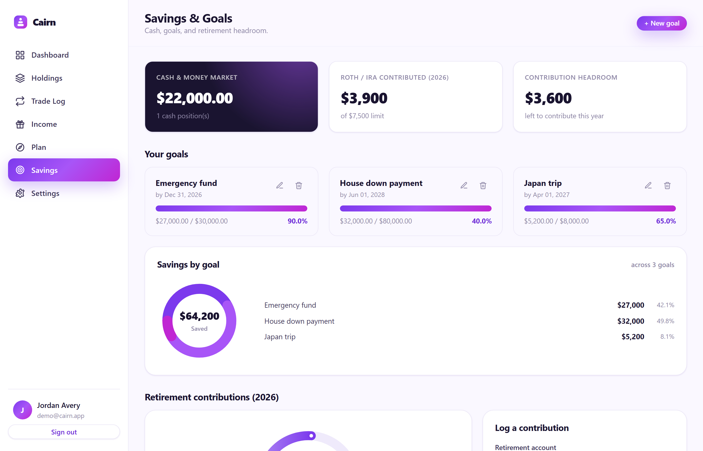
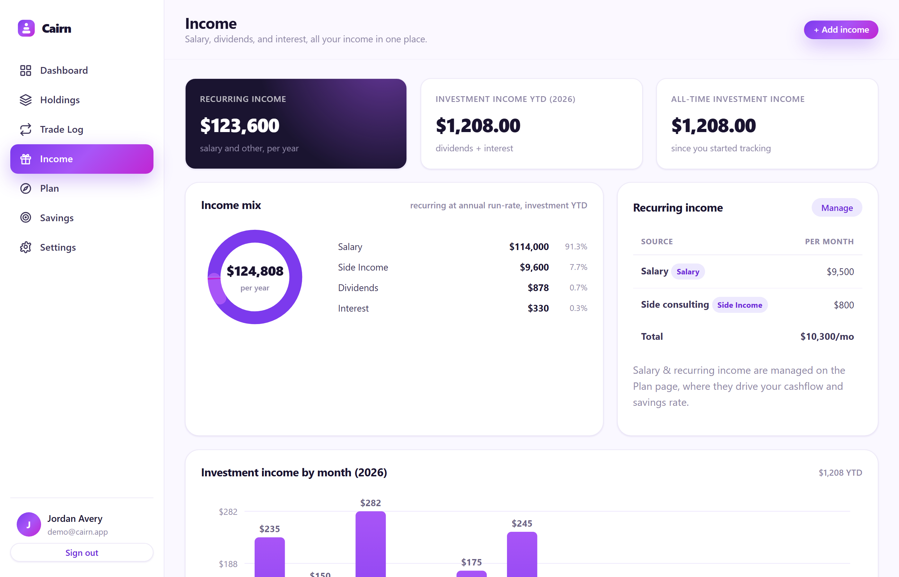
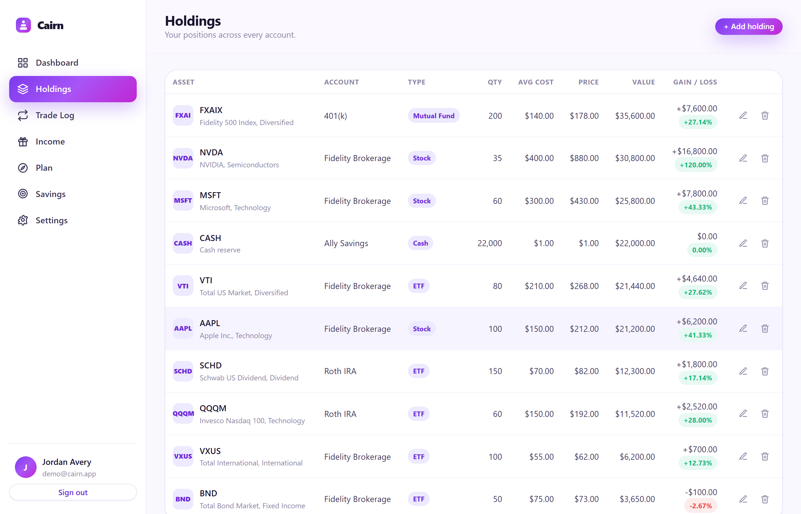

<div align="center">

<h1>Cairn</h1>
<p>A secure, multi-user personal finance tracker for savings, investments, dividends, and goals.</p>
</div>

---

> Not financial advice. Cairn is a personal tracking and modeling tool only. It
> does not provide financial, investment, tax, or legal advice and makes no
> recommendation to buy or sell any security. Projections are hypothetical
> illustrations and market data may be delayed. All decisions are your own.

## Screenshots

### Dashboard



### Financial plan



### Savings and goals



### Income



### Holdings



## Features

- Private accounts. Each person signs up and sees only their own data.
  Isolation is enforced at the database-query layer.
- Dashboard. Total value, unrealized and realized P&L, total return, and
  allocation by account, asset type, and industry, with charts.
- Growth chart. An area chart of cumulative money earned or lost (realized P&L
  plus income) over time.
- All-asset portfolio. Stocks, ETFs, mutual funds, crypto, bonds, options, real
  estate, commodities, cash, and anything else.
- Live ticker search. Type a symbol or company name to get live results and the
  current price from Yahoo Finance, fetched server-side.
- Trade log. Log a buy or sell and your holdings, average cost basis, and
  realized P&L update automatically.
- Income tracker. Dividends and interest by type and account, with income year
  to date, shown alongside your recurring (salary) income.
- Financial plan. Add your job and expenses to see surplus, savings rate,
  emergency-fund readiness, a model investing posture (Aggressive through
  Capital Preservation) with a stock/bond/cash split, and growth projections.
- Savings and goals. Progress bars for goals plus Roth/IRA contribution
  tracking across all retirement accounts combined.
- Live price refresh. One click updates stock, ETF, mutual-fund, and crypto
  prices.

## Security

Built for sensitive financial data:

- Argon2id password hashing (memory-hard, tuned parameters).
- Database-backed, revocable sessions. HttpOnly and SameSite cookies; only a
  SHA-256 hash of the session token is stored, so a leaked database cannot be
  replayed.
- CSRF tokens and same-origin checks on every mutating request.
- A strict Content-Security-Policy and a full set of security headers
  (X-Frame-Options, X-Content-Type-Options, Referrer-Policy, and more).
- Rate limiting on sign-in, registration, password change, price refresh, and
  market-data lookups.
- no-store caching on every page.
- Account-enumeration-resistant login (constant-time dummy verification).
- Per-user data isolation enforced in every query.

## Download and run

Cairn runs **locally on your own machine** — you download the code and start
it, and your data stays in a file on your computer. Nothing is uploaded
anywhere.

### 1. Prerequisites

- **Python 3.10 or newer** — https://www.python.org/downloads/
  (on Windows, tick **"Add Python to PATH"** during installation).
- **Git** — optional, only needed for the `git clone` method below.

### 2. Get the code

Clone it with Git:

```bash
git clone https://github.com/GeorgeJohnson04/CairnFinance-App.git
cd CairnFinance-App
```

…or, with no Git: on the GitHub page click the green **Code** button →
**Download ZIP**, then unzip it and open the folder.

### 3. Run it

**Option A — run from source (simplest, works on Windows/macOS/Linux):**

```bash
pip install -r requirements.txt
python run.py
```

Then open **http://127.0.0.1:5000** in your browser. Press `Ctrl+C` in the
terminal to stop the server.

**Option B — build a double-click Windows app (.exe):**

```bash
pip install -r requirements.txt
python build_exe.py
```

This produces **`dist/Cairn.exe`**. Double-click it — it starts the server,
opens your browser automatically, and stores its data in a portable
`Cairn-data` folder next to the executable. It runs at http://127.0.0.1:5000
and only one copy runs at a time, so relaunching always shows the latest build.

> **Beta testers:** there is **no prebuilt download** attached to the repo —
> the build output is intentionally not committed — so use **Option A**, or
> **Option B** to build your own `.exe`. Either way Cairn runs only on your
> machine via a local server; this is for testing and uses Flask's development
> server, not a production one.

## Using Cairn (first run)

1. **Create an account.** Open the app, click *Get started*, and register with
   an email and password. You'll see the no-financial-advice notice; every
   account is private and isolated from all others.
2. **Add an account.** Go to *Settings → Add account* (brokerage, retirement,
   savings, cash…). Holdings live inside accounts.
3. **Add holdings.** On *Holdings*, click *+ Add holding* and use the live
   ticker search to pull the current price — or enter any other asset (bonds,
   real estate, commodities…) and its value manually.
4. **Log trades.** On *Trade Log*, record buys and sells; your holdings,
   average cost basis, and realized P&L update automatically.
5. **Track income.** Log dividends and interest on *Income*.
6. **Build your plan.** On *Plan*, add your job/income and monthly expenses to
   see your surplus, savings rate, emergency-fund readiness, and a model
   investing posture.
7. **Refresh prices.** Click *Refresh prices* on the dashboard to pull the
   latest stock, ETF, mutual-fund, and crypto prices.

Want to start with real data instead? See
[Import the old Excel workbook](#import-the-old-excel-workbook) below.

## Import the old Excel workbook

Bring in a Finance Project.xlsx, with its known spreadsheet errors corrected on
the way in:

```bash
python import_excel.py --file "path/to/Finance Project.xlsx" \
    --email you@example.com --create --name "Your Name"
```

Corrections applied during import:

1. Account names are trimmed, so "Fidelity " becomes "Fidelity" and totals
   never silently drop rows the way the spreadsheet's SUMPRODUCT did.
2. Asset types are normalized (the trade log had XLE as a Stock; it is an ETF).
3. Money-market trades with a missing price default to $1.00 per share.
4. Realized P&L is recomputed consistently for every sell.
5. Every account is included in every breakdown. The Excel dashboard left
   Robinhood Roth IRA out of its by-account and income summaries.
6. "Without retirement" totals are derived from each account's type, fixing the
   W/O ROTH formula that excluded the Fidelity CMA.
7. Roth contributions and the annual limit become structured records instead of
   hardcoded cells.

## How the planner works

The plan is an illustrative model, not advice. It:

- normalizes every income source and expense to a monthly figure;
- computes surplus, savings rate, and emergency-fund readiness (target is
  monthly expenses times your chosen number of months);
- derives a target equity weight from the classic "120 minus age" rule of
  thumb, adjusted by your self-reported risk tolerance (1 to 5);
- maps that to a posture label and a stocks/bonds/cash split;
- projects illustrative 10, 20, and 30 year growth of the suggested monthly
  investment at a blended expected return.

## Project layout

```
run.py                 # dev entry point
launcher.py            # desktop/exe entry point (opens browser)
build_exe.py           # PyInstaller build script (builds in a temp dir)
import_excel.py        # one-time Excel importer (CLI)
tests/smoke_test.py    # end-to-end smoke test (Flask test client)
assets/                # logo, favicon, and screenshots
app/
  __init__.py          # app factory, security headers, template filters
  db.py                # SQLite schema and versioned migrations
  security.py          # Argon2, sessions, CSRF, rate limiting, validators
  auth.py              # register / login / logout
  portfolio.py         # app pages and JSON market-data endpoints
  services/
    compute.py         # portfolio math: cost basis, P&L, aggregations, growth
    planning.py        # cashflow and model investing posture
    prices.py          # Yahoo/CoinGecko search, quotes, bulk refresh
    importer.py        # Excel import with the corrections above
  static/js/charts.js  # hand-rolled SVG charts (donut, bar, gauge, area, flow)
  templates/  static/  # Jinja templates and the white/purple design
```

## Tests

```bash
python tests/smoke_test.py
```

Covers registration, login, CSRF rejection, per-user data isolation, cross-user
access (404), holdings/trades/income/plan flows, the growth chart, and security
headers.

## Tech

Python, Flask, SQLite, Argon2id, and vanilla JavaScript (hand-rolled SVG
charts, no front-end framework). Market data from Yahoo Finance and CoinGecko.

## License

MIT. See [LICENSE](LICENSE).

